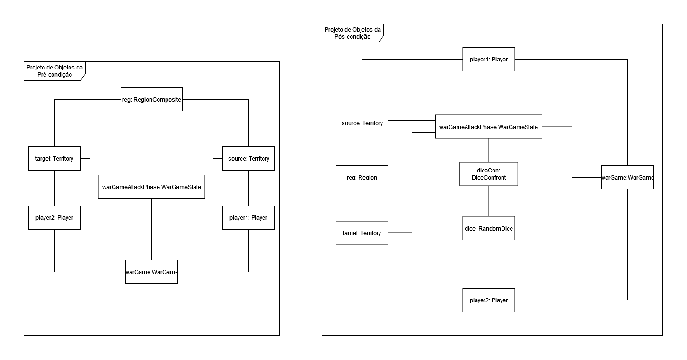
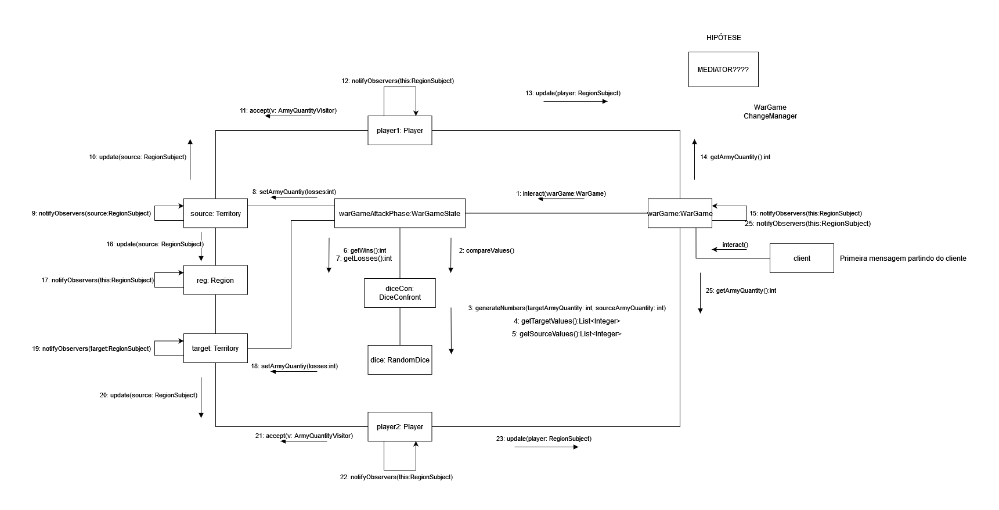

# Contrato de operação: attackTerritory

## Operação: 
`interact()`
## Referências cruzadas
Caso de Uso: Atacar Território
## Pré condições:
- Existe uma instância warGame de WarGame(**Criação de instância**)
- Existe uma instância attackPhase de WarGamePhaseState(**Criação de instância**)
- Existe uma instância jogador1 de Player (**Criação de instância**)    
- Existe uma instância jogador2 de Player (**Criação de instância**)
- jogador1 está associado a warGame (**Relação estabelecida**)
- jogador2 está associado a warGame (**Relação estabelecida**)     
- Existe uma instância reg de Region (**Criação de instância**)
- Existe uma instância source de Territory (**Criação de instância**)
- source está associado a jogador1 (**Relação estabelecida**)
- Existe uma instância target de Territory (**Criação de instância**)
- target está associado a jogador2 (**Relação estabelecida**)
- source.armyQuantity é maior que 2 (**Modificação de atributo**)
- source está associado a reg (**Relação estabelecida**)
- target está associado a reg (**Relação estabelecida**)
- target está associada a attackPhase(**Relação Estabelecida**)
- source foi associada a attackPhase(**Relação Estabelecida**)
## Pós condições:
- attackPhase.sourceArmy tornou-se maxArmyNumber a partir do valor de source.armyQuantity (**Modificação de atributo**)
- attackPhase.targetArmy tornou-se maxArmyNumber a partir do valor target.armyQuantity (**Modificação de atributo**)
- foi criada uma instância dice de Dice(**Criação de instância**)
- foi criada uma instância diceCon de DiceConfront(**Criação de instância**)
- dice foi associada a dicecon de DiceConfront(**Relação Estabelecida**)
- diceCon foi associada a attackPhase (**Relação Estabelecida**)
- diceCon.wins teve seu valor alterado a partir de dice.sourceValues e dice.targetValues (**Modificação de atributo**)
- diceCon.losses teve seu valor alterado a partir de dice.sourceValues e dice.targetValues (**Modificação de atributo**)
- attackPhase.sourceArmy tornou-se attackPhase.sourceArmy - diceCon.losses (**Modificação de atributo**)
- attackPhase.targetArmy tornou-se attackPhase.targetArmy - diceCon.wins (**Modificação de atributo**)
- target.armyQuantity teve seu valor alterado a partir de attackPhase.targetArmy (**Modificação de atributo**)
- source.armyQuantity teve seu valor alterado a partir de attackPhase.sourceArmy (**Modificação de atributo**)

## Projeto de Objetos:

|  | 
|:--:| 
| *Projeto de Objetos da pré e pós condição* |

## Diagrama de Colaboração:

|  | 
|:--:| 
| *Projeto de Objetos da pré e pós condição* |

